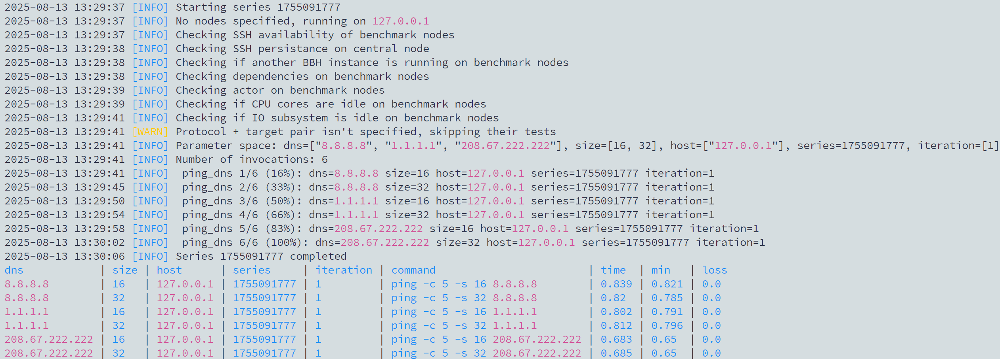
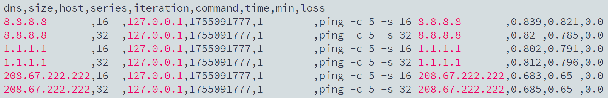
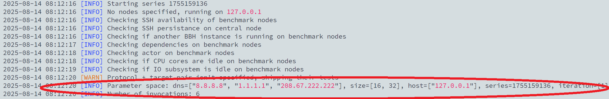
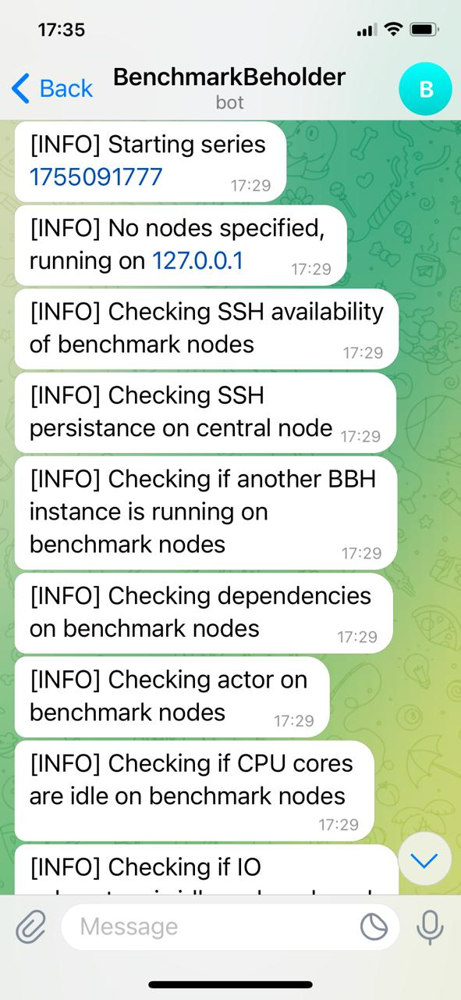
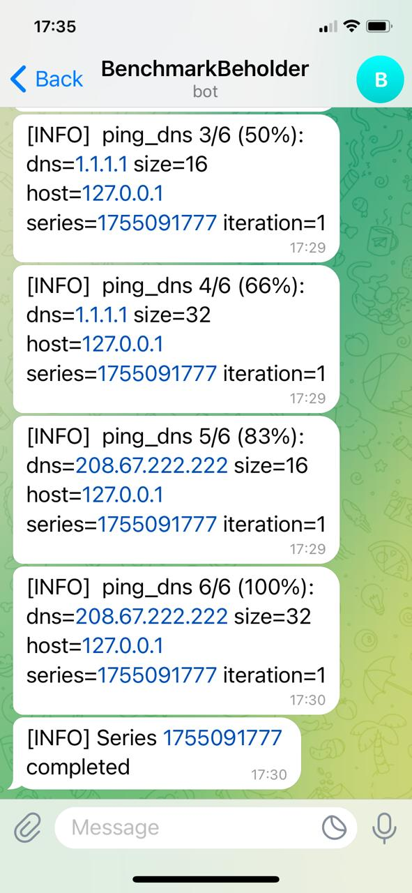

<p align="center">
  
</p>

<h1 align="center">BenchmarkBeholder</h1>
<p align="center">
  <b>Benchmark any workload, explore every parameter combination, and uncover the performance sweet spot</b>
</p>

---

**BenchmarkBeholder (BBH)** is a universal benchmarking tool for <b>any workload</b> — from AI models and APIs to databases, filesystems, GPUs, and beyond. It runs <b>all parameter combinations</b> for your task, measures target metrics, and reveals the optimal setup, trends, and bottlenecks — all in a single sweep.

---

## What is BBH?

BBH systematically benchmarks your workload across all combinations of its input parameters.
It helps you answer basic questions:

- How do I tune for maximum performance and scalability?
- Which implementation or config is best for my task?
- How can I prove it’s tuned optimally?

---

## Example Use Case

You're building a chatbot. With BBH, you can:

- Compare AI models for speed and quality.
- Evaluate GPUs by performance-to-cost.
- Test RAM or storage setups (e.g. for RAG caching).
- Choose the best infrastructure combo overall.

---

## R.E.A.L. Features

- **Reproducible** — Stores all configs and metrics.
- **Extensible** — Works with any workload or platform (AWS, Azure, OCI).
- **Accumulative** — Saves results in CSV for long-term tracking.
- **Lucid** — Complete performance landscape for visualization in Excel, Power BI, Tableau, etc.

---

## Quick Start

```bash
./bbh ./workloads/ping_dns.json
```
BBH runs all parameter combinations of the specified workload:
<p align="center">
  
</p>
Saves results as a CSV file:
<p align="center">
  
</p>
And you're ready to analyze it in any BA/BI tool you like:
<p align="center">
  
</p>

Sometimes, number of parameter combinations for your workload can grow huge. You can assess it before actual benchmark using `./bbh -s ./workload/ping_dns.json`:

<p align="center">
  
</p>

## Telegram Logging
Get real-time progress updates by setting up a bot via @BotFather.
Save the token to `~/.bbh/telegram` and BBH will log to your phone automatically:

<p align="center">
  
  
</p>

## Full Technical Documentation

[Learn more](doc/full.md).
