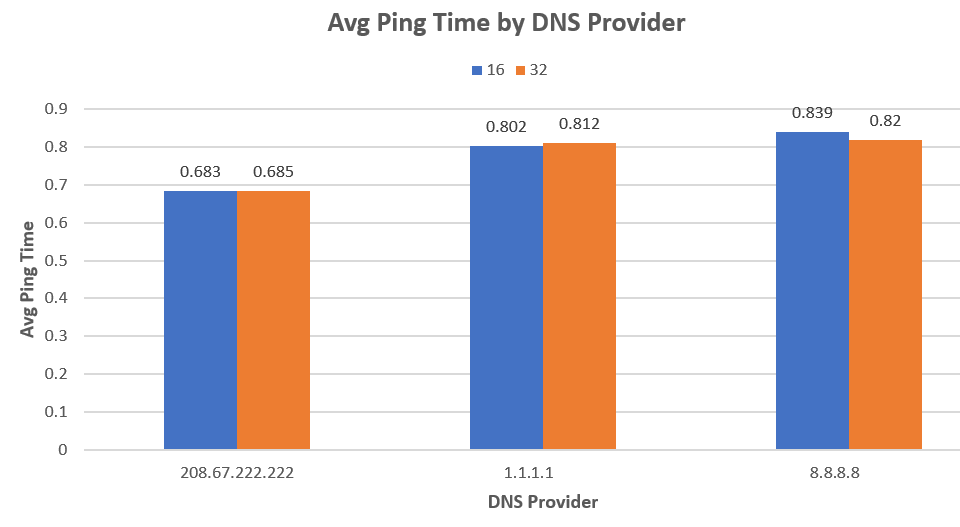

<p align="center">
  
</p>

# About

BenchmarkBeholder, abbreviated BBH, is a tool for performance benchmarking of ANY workload against ALL combinations of input parameters of the workload.
Without exaggeration, the workload can be anything you can measure: application, AI model, HTTP server, filesystem, database, block device, GPU, RAM, and so forth.

BBH helps you answer hot and practical questions:

* **HOW DO I TUNE MY WORKLOAD FOR THE HIGHEST PERFORMANCE AND SCALABILITY ?**
* **WHAT IMPLEMENTATION OF MY WORKLOAD SHOULD I CHOOSE FOR THE TASK ?**
* **HOW DO I PROVE IF MY WORKLOAD HAS BEEN TUNED AT ITS BEST ?**

BBH's approach of sweeping over all valid combinations of input parameters and benchmarking target metrics for each combination is called sweep analysis.
When it clarifies these three questions for you, it does it constructively: you will disclose optimal  and suboptimal combinations of parameters, quantified influence of parameters, and trends and edge cases, if any.

For instance, you need to choose an optimal AI model and SW+HW configuration for a chatbot. With BBH, you will easily:
* Compare and choose highest-performing AI model for your task
* Compare and choose optimal storage by performance/cost ratio
* Assess performance of CPU RAM and decide if you should use CPU RAM as RAG cache for your task
* Compare performance/price of different GPU models and choose the optimal GPU

# What Makes it Cool

Given your workload, BBH unfdolds its entire performance landscape. This makes benchmarking insightful, efficient, comfortable, and complete - thanks to R.E.A.L. paradigm implanted in BBH:

**REPRODUCIBLE.** BBH stores benchmark results together with configuration, input, and infrastructure metrics, making the result reproducible.

**EXTENSIBLE.** BBH integrates with ANY workload in ANY environment on different clouds: in particular, it detects [AWS](https://aws.amazon.com/), [Azure](https://azure.microsoft.com/), and [OCI](https://cloud.oracle.com/).

**ACCUMULATIVE.** BBH stores benchmark results in universal CSV format, allowing you to accumulate, compare, and merge them over years, for different app versions, HW generations, etc.

**LUCID.** BBH unfdolds the entire performance landscape for you, leaving no stone unturned: you can use any BA/BI tool to visualize and analyze performance landscape.

# Benchmarking Approach

* As input, BBH takes *workload file* that describes
  * The workload you want to benchmark
  * Desired values of input parameters of your workload
* BBH builds *parameter space*, that is, all combinations of the values of the parameters
* BBH invokes your workload against all combinations from the parameter space
* For each invocation, BBH collects metrics you specifed
* Optionally, BBH enriches them with infrastructure metrics from the environment it runs on
* Finally, BBH provides CSV report with benchmark results: combination of parameter values, calculated metrics, and (optional) infeastructure metrics

# Quick Start

Let's take an example. Perhaps, we want to answer the question: **how do I achieve the best ping latency to global DNS service?** Just type:

```bash
./bbh ./workloads/ping_dns.json
```

BBH will run `ping` command with multiple different combinations of `ping` parameters, and generate a table with benchmark results upon completion:

<p align="center">
  
</p>

The same results will be saved in CSV format to `./log/bbh-ping_dns-1754564563-result.csv`, where `ping_dns` is the name of workload, and `1754564563` is a globally unique identifier of the benchmarking series you launched:

<p align="center">
  
</p>

Now, you can open the CSV file in any BA/BI tool you like, visualize it, and analyze performance sweetspots of the `ping` to DNS providers:

<p align="center">
  
</p>

# Telegram Logging

Benchmarking can take long time. For your convenience, you can tell BBH to duplicate its logging to [Telegram](https://telegram.org/) on your mobile device.
Then you'll be able to track progress in real time. This is especially convenient for debugging purposes, when you want to quickly see if something goes weird. Enabling Telegram logging takes two steps:
1. Create Telegram bot: open Telegram, search for `@BotFather`, type `/newbot` and follow instructions
2. Put the bot token to `~/.bbh/telegram` file on the machine that launches `./bbh`

That's it. During next launch, BBH will notice the token and start duplicating its log to your bot:

<p align="center">
  
  
</p>

NOTE: By design, Telegram makes inactive bot go asleep by timeout. If `./bbh` tells you that the bot has gone asleep, just awake the bot by sending any text to it.

# Workload Description
As we explore ping latency, we start from the fact that `ping` requires two parameters: URL of DNS provider and packet size.
Therefore, our workload file `./workloads/ping_dns.json` should specify valid values of these parameters. For instance, it can be the following (except for my comments - JSON doesn't support them):
```jsonc
{
        "workload": { 			// mandatory section: general configuration of the benchmark
                "hook": "ping_dns", 	// location of integration files: ./sources/hooks/ping_dns/
                "actor": "ping", 	// application to benchmark
                "iterations": 4		// how many times to repeat each invocation; comes in handy to build sustainable result
        },
        "parameters": { 		// mandatory section: input parameters to use during benchmarking
                "dns": [ "8.8.8.8", "1.1.1.1", "208.67.222.222" ],
                "size": [ 16, 32 ]
        }
}
```

This example gives you an idea of how you can describe ANY workload configuration for BBH.

# What Workloads Can I Benchmark Right Now?

You can see already integrated workloads by typing `./bbh -v`. In the example below, `dd` and `ping_dns` workloads are already integrated. In this repository, new workloads are added regularly.

```bash
2025-08-11 20:34:40 [INFO] Starting series 1754944480
2025-08-11 20:34:40 [INFO] ### BenchmarkBeholder ###
2025-08-11 20:34:40 [INFO] Home page: https://github.com/Yuri-Rassokhin/BenchmarkBeholder
2025-08-11 20:34:40 [INFO] Supported workloads: dd, ping_dns
2025-08-11 20:34:40 [INFO] Supported cloud platforms: OCI, AWS, Azure
2025-08-11 20:34:40 [INFO] Supported local filesystems: XFS, ext3/4, btrfs, and any other POSIX-compliant
2025-08-11 20:34:40 [INFO] Supported shared filesystems: GlusterFS, NFS, BeeGFS
2025-08-11 20:34:40 [INFO] Supported special storage: raw block device, mdadm RAID, tmpfs, ramfs, brd, vboxsf
2025-08-11 20:34:41 [INFO] Supported operating systems: Ubuntu, RHEL/CentOS, Fedora, Oracle Linux
```

# How Do I Benchmark New Workload?

To benchmark a new workload, it must be integrated to BBH.
You have to write three simple files: workload description; workload schema; and workload metrics.
You shall find an example of [ping_dns](./sources/hooks/ping_dns) integration.

